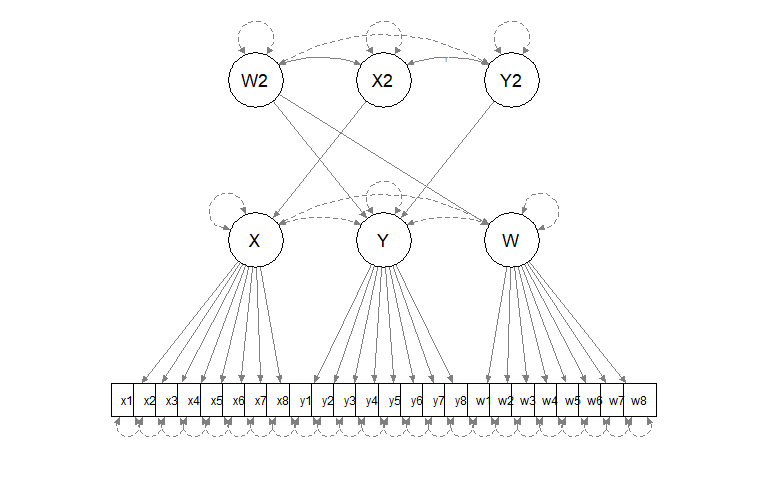
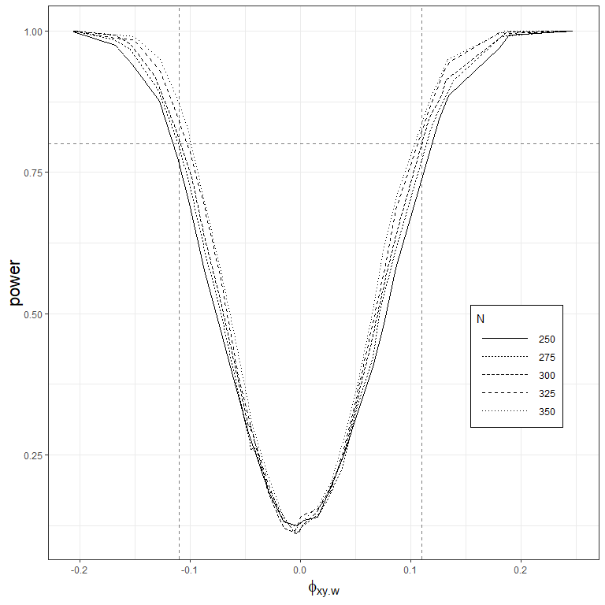

Latent Semi-partial Correlations - Simulation
================
Tyler J. Ryan
November 21, 2018

[Preacher (2009)](https://scholar.google.com/scholar?cluster=3579032783597219013&hl=en&as_sdt=0,36) provides a framework for testing correlational hypotheses in an SEM framework. The following is R code for a simulation study to estimate power for testing semi-partial correlation hypotheses between two latent variables (*x*,*y*), controlling for a third variable (*w*) in *y*.

We will be using the `lavaan` package (Rosseel, 2012).

``` r
library(lavaan)
```

We create a function `latentSemipartCor.datagen()`, which takes a sample size `N`, and a set of correlations between the three variables, `XYcor`, `XWcor`, and `YWcor`. The function requires the `mvtnorm` package to be installed.

``` r
latentSemipartCor.datagen <- function(N = N, XYcor = XYcor, 
                                      XWcor = XWcor, YWcor = YWcor) {
  
  require(mvtnorm) # required to general random MVN latent variables
  
  # Generate random multivariate normal latent variables (Ksi) with 
  # variance-covariance matrix (Phi) defined by pregiven XY, XW, and
  # YW correaltions and mean of 0. 
  
  Phi <- matrix(c(     1, XYcor, XWcor,
                   XYcor,     1, YWcor,
                   XWcor, YWcor,     1), nrow = 3)
  
  Ksi <- rmvnorm(N, mean = c(0, 0, 0), sigma = Phi)
  
  colnames(Ksi) <- c("X", "Y", "W")
  
  # Generate observed variables with loadings of .8 and
  # residual variances of .36, such that each variable has
  # a variance of ~ 1.0.
  
  x1 <- .8 * Ksi[,"X"] + (sqrt(1 - .8^2)) * rnorm(N, 0, 1)
  x2 <- .8 * Ksi[,"X"] + (sqrt(1 - .8^2)) * rnorm(N, 0, 1)
  x3 <- .8 * Ksi[,"X"] + (sqrt(1 - .8^2)) * rnorm(N, 0, 1)
  x4 <- .8 * Ksi[,"X"] + (sqrt(1 - .8^2)) * rnorm(N, 0, 1)
  x5 <- .8 * Ksi[,"X"] + (sqrt(1 - .8^2)) * rnorm(N, 0, 1)
  x6 <- .8 * Ksi[,"X"] + (sqrt(1 - .8^2)) * rnorm(N, 0, 1)
  x7 <- .8 * Ksi[,"X"] + (sqrt(1 - .8^2)) * rnorm(N, 0, 1)
  x8 <- .8 * Ksi[,"X"] + (sqrt(1 - .8^2)) * rnorm(N, 0, 1)
  
  y1 <- .8 * Ksi[,"Y"] + (sqrt(1 - .8^2)) * rnorm(N, 0, 1)
  y2 <- .8 * Ksi[,"Y"] + (sqrt(1 - .8^2)) * rnorm(N, 0, 1)
  y3 <- .8 * Ksi[,"Y"] + (sqrt(1 - .8^2)) * rnorm(N, 0, 1)
  y4 <- .8 * Ksi[,"Y"] + (sqrt(1 - .8^2)) * rnorm(N, 0, 1)
  y5 <- .8 * Ksi[,"Y"] + (sqrt(1 - .8^2)) * rnorm(N, 0, 1)
  y6 <- .8 * Ksi[,"Y"] + (sqrt(1 - .8^2)) * rnorm(N, 0, 1)
  y7 <- .8 * Ksi[,"Y"] + (sqrt(1 - .8^2)) * rnorm(N, 0, 1)
  y8 <- .8 * Ksi[,"Y"] + (sqrt(1 - .8^2)) * rnorm(N, 0, 1)
  
  w1 <- .8 * Ksi[,"W"] + (sqrt(1 - .8^2)) * rnorm(N, 0, 1)
  w2 <- .8 * Ksi[,"W"] + (sqrt(1 - .8^2)) * rnorm(N, 0, 1)
  w3 <- .8 * Ksi[,"W"] + (sqrt(1 - .8^2)) * rnorm(N, 0, 1)
  w4 <- .8 * Ksi[,"W"] + (sqrt(1 - .8^2)) * rnorm(N, 0, 1)
  w5 <- .8 * Ksi[,"W"] + (sqrt(1 - .8^2)) * rnorm(N, 0, 1)
  w6 <- .8 * Ksi[,"W"] + (sqrt(1 - .8^2)) * rnorm(N, 0, 1)
  w7 <- .8 * Ksi[,"W"] + (sqrt(1 - .8^2)) * rnorm(N, 0, 1)
  w8 <- .8 * Ksi[,"W"] + (sqrt(1 - .8^2)) * rnorm(N, 0, 1)
  
  X <- data.frame(x1, x2, x3, x4, x5, x6, x7, x8,
                         y1, y2, y3, y4, y5, y6, y7, y8,
                         w1, w2, w3, w4, w5, w6, w7, w8)
  
return(X)

}
```

We then define the model to be estimated.

``` r
model <- "

  # Define first order latent variables

    X =~ x1 + x2 + x3 + x4 + x5 + x6 + x7 + x8
    Y =~ y1 + y2 + y3 + y4 + y5 + y6 + y7 + y8
    W =~ w1 + w2 + w3 + w4 + w5 + w6 + w7 + w8

  # Set first order latent variances and covariances to 0
    
    X ~~ 0*X
    Y ~~ 0*Y
    W ~~ 0*W
    
    X ~~ 0*Y
    W ~~ 0*Y
    W ~~ 0*X

  # Define Second order latent variables

    W2 =~ W + Y
    X2 =~ X
    Y2 =~ Y

  # Define second order latent variances and covariances

    W2 ~~ X2
    Y2 ~~ r * X2
    Y2 ~~ 0 * W2
    
    W2 ~~ 1 * W2
    X2 ~~ 1 * X2
    Y2 ~~ 1 * Y2

"
```

We can plot the model diagram with `semPlot` (Epskamp & Stuber, 2017) package.

``` r
library(semPlot)
semPaths(lavaanify(model))
```



Next, we define our population parameters from which to generate our data. For the present simulation, we hold *ϕ*<sub>*x**w*</sub> constant at -.8, vary *ϕ*<sub>*x**y*</sub> between -.3 and -.2 by increments of .05, vary *ϕ*<sub>*y**w*</sub> between .2 and .3 by increments of .05, and set our observed *N* for each set of samples to vary between 250 and 350 with increments of 25. We also set the number of samples to generate for each sample size and combination of latent correlations to 1000.

``` r
XYCor <- seq(-.2, -.3, -.05)
XWcor <- -.8
YWCor <- seq(.2, .3, .05)
Ns <- seq(250, 350, by = 25)

iterations <- 1000
```

We create an empty `models` object to save each generated model summary to. The nested `for` loop structure iterates through each combination of latent correlations and sample size, generating and analyzing 1000 simulated data sets for each. Summaries for the parameters and fit statistics of each model are saved to the `models` object. For 1000 iterations for each combination, the whole process takes several hours, but could be sped up with parallel processing.

``` r
models <- data.frame()

for (xycor in XYCor) {
  
  for (ywcor in YWCor) {
    
    for (N in Ns) {
    
    # The replicate() function loops through expr 1000 times 
    # as defined by iterations. Setting simplify = F returns 
    # a list() which is easier to work with.
    simulations <- replicate(iterations, simplify = F, expr = { 
    
      # Generate data with specified population parameters
      observed <- PID_datagen(N = N, 
                              XYcor = xycor, 
                              XWcor = XWcor, 
                              YWcor = ywcor)
      
      # Run model with lavaan() function
      try(mod <- lavaan(model, observed, auto.fix.first = T, auto.var = T))
      
      # Check if model converged. If it did not, skip to the 
      # next iteration in the replicate() loop
      if(!mod@optim$converged) {
        next
      }
      
      # Obtain fit statistics from model
      modfit <- t(as.matrix(fitmeasures(mod)[c("npar", "chisq", "df", "aic",
                                               "bic", "cfi", "tli", "rmsea")]))
      
      # Combine fit statistics with a table of model parameter info 
      # and add info on N and population correlations
      modpar <- cbind.data.frame(parameterestimates(mod), modfit)
      modpar$N <- N
      modpar$XYcor <- xycor
      modpar$YWcor <- ywcor
                       
      return(modpar)
      
    })
    
    # When the replicate() loop is complete, the simulations object
    # should be a list of 1000 dataframes with model info. We can
    # combine these into a single data.frame with the do.call() and 
    # rbind() functions.
    simulations.df <- do.call(rbind, simulations)
    
    # We use the rbind() function again to combine the simulations.df
    # for a given set of population correlations and N to our total
    # set of simulations in the models data.frame.
    models <- rbind(models, simulations.df)
    
    # Finally, we print information about a given loop to keep us updated
    # on the progress.
    print(paste0("XYcor = ", xycor, "; YWcor = ", ywcor, "; N = ", N))
    
    }
  }
}
```

When our simulations are finished, we can aggregate the results of our models and calculate power.

``` r
# Specify the information we want to aggregate
aggvars <- c("est", "se", "z", "pvalue", "ci.lower", 
             "ci.upper", "npar", "chisq", "df",      
             "aic", "bic" ,"cfi" , "tli", "rmsea")

# Specify what to aggregate our model information by. In this case, 
#we aggregate by parameter, N, and population correlations.
aggby <- list("lhs" = models$lhs, "op" = models$op, "rhs" = models$rhs,
              "N" = models$N, "XYcor" = models$XYcor, "YWcor" = models$YWcor)

models.agg <- aggregate(models[, aggvars], by = aggby, mean)

# Calculate power as the percentage of significant p-values for each parameter. 
models.agg$power <- unlist((aggregate(models[, "pvalue"], 
                                      by = aggby, 
                                      function(x) mean(x < .05, na.rm = T)))$x)
models.agg$par <- with(models.agg, paste0(lhs, op, rhs))
models.agg[which(models.agg$par == "")]
```

We can plot the power of our tests of significance for the semi-partial correlation of interest as a function of the estimate and sample size. We will require the `ggplot2` package. If our minimum effect size for the semi-partial correlation is *ϕ*<sub>*x*(*y*.*w*)</sub> = ± .10, we can plot this as two vertical lines on the x-axis. We also plot our targeted level of power (.8) as a horizontal line on the y-axis.



We can also look at a table of the estimates we are concerned about.

``` r
models.agg[which(models.agg$par == "X2~~Y2" & 
                 models.agg$est >= .1 &
                 models.agg$est <=.12),
           c("par", "N", "est", "se", 
             "cfi", "rmsea", "power")]
```

    ##         par   N       est         se       cfi      rmsea power
    ## 8051 X2~~Y2 250 0.1180549 0.03898905 0.9860467 0.03000852 0.791
    ## 8115 X2~~Y2 275 0.1182516 0.03734902 0.9869298 0.02903771 0.824
    ## 8179 X2~~Y2 300 0.1169197 0.03564676 0.9872534 0.02890756 0.843
    ## 8243 X2~~Y2 325 0.1173100 0.03429464 0.9876632 0.02847929 0.863
    ## 8307 X2~~Y2 350 0.1190771 0.03313717 0.9877304 0.02846306 0.884

With this simulation, we can be confident that a minimum sample size of around 300 is sufficient for testing a latent semi-partial correlation.

References

Preacher, K. J. (2009). Testing complex correlational hypotheses with structural equation modeling. *Structural Equation Modeling: A Multidisciplinary Journal, 13*, 520-543. [doi.org/10.1207/s15328007sem1304\_2](https://doi.org/10.1207/s15328007sem1304_2)

Rosseel, Y. (2012). lavaan: an R package for structural equation modeling. *Journal of Statistical Software, 48*, 1-36. <http://www.jstatsoft.org/v48/i02/>

Epskamp, S., Stuber, S. (2017). semPlot: Path Diagrams and Visual Analysis of Various SEM Packages' Output. <https://CRAN.R-project.org/package=semPlot>
